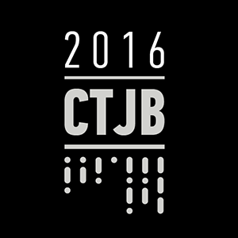

# CTJB

## 2016

Kemp sa konal 1.9.2016 - 4.9.2016 vo Vire, Ceska Republika

## Fotky

* [od laily](https://imgur.com/a/Vd1G0)

## Program

### Stvrtok

| kedy  | kto     | co                                   | kolko  |
|-------|---------|--------------------------------------|--------|
| 13:00 | .       | camp door open                       |        |
| 19:00 | .       | oficialne zahajenie programu         | 15 min |
| 19:15 | mazegen | [Vitejte ve Viru!](2016/welcome.pdf) | 40 min |
| 21:00 | .       | party                                |        |

### Piatok

| kedy  | kto                | co                                                                                                    | kolko  |
|-------|--------------------|-------------------------------------------------------------------------------------------------------|--------|
| 13:00 | Laila              | rorschach tshirt - vyrobime si originalne tricka s rorschachovymi skvrnami (donestesi biele bavlnene) | 60 min |
| 14:00 | infinity           | Bugbounty programy a jak na ne                                                                        | 30 min |
| 14:30 | pavel              | [Naklikejte si sveho kone](2016/klikr.pdf) (psa, kravu, slepici, kosatku) [schema](2016/dsc02547.jpg) | 30 min |
| 15:00 | sorki              | Velobot - Open hardware bike computer                                                                 | 30 min |
| 15:30 | eugen              | [Once a cheater always a cheater](2016/cheaters_pdf)                                                  | 60 min |
| 16:30 | .                  | Predstavenie hackerspaceov: Base48, Brmlab, Labka, [Progressbar+Paralelny polis](2016/pgb_pp.pdf)     | 60 min |
| 17:30 | juraj & Petr Žílka | Decentralizace moci, Limited edition umenie v blockchaine a hackovanie sveta                          | 30 min |
| 18:00 | .                  | Lightning talky (round 1 - viz nizsie)                                                                | 60 min |
| 19:00 | .                  | Visibility is a Trap by Adam Csoka Keller                                                             | 30 min |
| 22:00 | .                  | [Ventolin](https://www.youtube.com/watch?v=_94m_hqorug) Live                                          | 90 min |
| 24:00 | .                  | [DJ Inso](https://soundcloud.com/bwoxmass/bwo-x-mass-mix-01-by-inso) Grime DJ Set                     | 90 min |

#### Lightning Talks

| kto   | co                                                                                            |
|-------|-----------------------------------------------------------------------------------------------|
| Jenda | [SYN, SYNACK, RST, RST, RST](2016/syn-synack.pdf) - Abusing misconfigured IPSs for simple DoS |
| Laila | Lekna - minuly rok sme nestihli a pytali ste sa na to                                         |
| Jenda | [E.T. Phone Home](2016/et.pdf) [web](https://brmlab.cz/user/jenda/et)                         |
| b42   | [Growing hydroponic vegetables](2016/hydroponics.pdf)                                         |
| Laila | #Toiletparty - ako sme zadelili masivny zur 32c3                                              |
| Karel | co to jsou crackmes a jak na ne                                                               |

### Sobota

| kedy  | kto           | co                                                                            | kolko  |
|-------|---------------|-------------------------------------------------------------------------------|--------|
| 11:00 | stick         | [tesba](https://www.youtube.com/watch?v=S3bpeeNh-a8)                          | 30 min |
| 11:30 | lexik         | Squatting: Co má společného pražský squat a (nejen) pražský hackerspace       | 30 min |
| 12:00 | Maxo          | [Ako ucim ludi aby vedeli so mnou robit](2016/maxo.pdf)                       | 30 min |
| 12:30 | Jan           | Elektornicke bicykle                                                          | 30 min |
| 13:00 | .cCuMiNn.     | [Panem World Wide Webu](2016/panem_www.pdf)                                   | 60 min |
| 14:00 | mazegen       | Huby okolo vas                                                                | 30 min |
| 14:30 | Sargon        | Senzory v elektrotechnike                                                     | 30 min |
| 15:00 | sachy         | [Cecenske drahy](2016/cecenske_drahy.pdf) [DB+skripty](http://brmcd.s0c4.net) | 30 min |
| 15:30 | sorki & lubko | [pignus.computer](https://pignus.computer) - rebuilding Fedora for Raspberry Pi | 30 min |
| 16:00 | pavel         | [Ochocte si Nokiu N900](2016/nokia_n900.pdf)                                  | 30 min |
| 16:30 | zlo           | [distribuovany sw load balancer](2016/lb.pdf) jako nahrada hw - proc, jak     | 30 min |
| 17:00 | Jenda         | [LFSR craptoanalysis](https://www.youtube.com/watch?v=IA3NaCoA_v4)            | 60 min |
| 18:00 | pavel         | [Hackujeme kernel](2016/kernel.pdf) - proc a jak                              | 60 min |
| 19:00 | jindra        | Vse co jste chteli vedet o Vine                                               | 30 min |
| 19:30 | .             | Lightning talky (round 2 - viz nizsie)                                        |        |
| 20:30 | videoart      | Asymptote by Natalia Evelyn Bencicova, Adam Csoka Keller and Arielle Esther   | 30 min |
| 21:30 |               | [K-O-L-E-K-T-I-V](https://vimeo.com/115139427) Live Session                   | 90 min |
| 23:00 |               | [DJ Inso](https://soundcloud.com/bwoxmass/bwo-x-mass-mix-01-by-inso) Jungle + Happy Hardcore DJ Set | |

#### Lightning Talks

| kto     | co                                                          |
|---------|-------------------------------------------------------------|
| Jenda   | Skodic                                                      |
| Maxo&co | ako vyrobit 6ty zmysel                                      |
| sorki   | Mapping with UAVs                                           |
| Jenda   | Kukuruku                                                    |
| lexik   | Jak se bavit s lidma                                        |
| shady   | [OSS Víkend Košice](2016/ossvikend.pdf)                     |
| karel   | [jihad online](https://www.youtube.com/watch?v=kNc2NfTOE4k) |

### Aktivity

| kto       | co                                                                          |
|-----------|-----------------------------------------------------------------------------|
| Matus F   | Skaut workshop                                                              |
| jenda     | [SDR Workshop](https://www.youtube.com/watch?v=i1ZB70nPF-g)                 |
| b42       | ansible workshop                                                            |
| pavel     | Proc se ten telefon nabiji pomalu? Aneb nikdy never cinske nabijecce        |
| Laila     | Svetlušky 1: vyrábame dekorácie z kuželov a podsvecujeme ich                |
| Laila     | Svetlušky 2: nočná prechádzka a trilkovanie lesom s glowstickmi             |
| Laila     | Svetlušky 3: bastlíme z glowstickov                                         |
| Laila     | Jóga: denne                                                                 |
| .cCuMiNn. | Webhacking4fun                                                              |
| Laila     | Piseme mame/babke/frajerke/skreckovi/komukolvek pohladnicu z tabora         |
| pavel     | Pojdme ulovit cache... nebo dve, a po ceste neco zmapovat pro OpenStreetmap |
| pavel     | Jak na fotky, a jak funguje fotak uvnitr                                    |
| mazegen   | Ferrata meetup                                                              |
| Laila     | 3D meetup (modelari, tlaciari a veskera haved spoj sa a ukaz na com robis)  |

## Food & Drink

* pivo (pyxel)
* kava (vanicka)
* varenie (klokanek, Laila)
